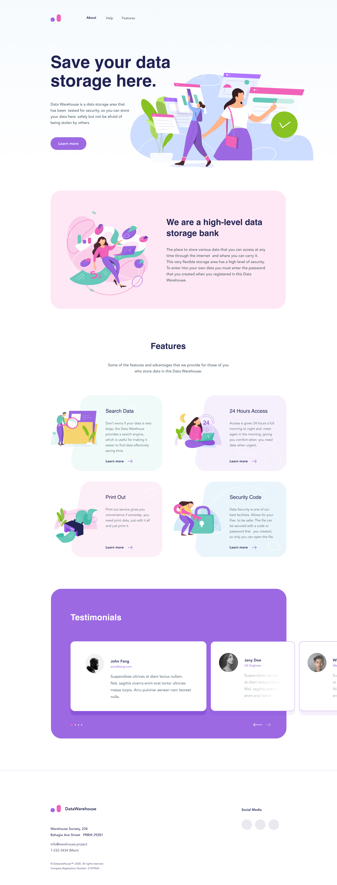

# Модуль 1

## Техническое задание

Разработка landing-page

Дизайн - [https://www.figma.com/file/VsA7lowyHmr0WUZAQ9X3n8/Ratio-courses?node-id=0%3A1](https://www.figma.com/file/VsA7lowyHmr0WUZAQ9X3n8/Ratio-courses?node-id=0%3A1)

Свёрстанная страница должна быть адаптивна под минимальный размер 320px (Iphone SE)

Верстка должна быть резиновой.

Меню служит навигацией по странице.

Анимации приветствуются.

Кнопка `Learn More` на первом экране - переносит пользователя на экран с заголовком Features.

Favicon - является логотип сайта

SEO 

- Title - `Warehouse - Save your data storage here.`
- Description - `Data Warehouse is a data storage area that has been
tested for security, so you can store your data here
safely but not be afraid of being stolen by others.`
- Keyword - `warehouse, save, data, security, storage, area`
- OpenGraph - на выбор разработчика.

## Применённые технологии:
- HTML5
- CSS3
- CSS-паттерны
- прогрессивное улучшение

---

***Ссылка на готовое приложение: [https://goodtimeforcoding.github.io/module1-production/](https://goodtimeforcoding.github.io/module1-production/)***

---

# Модуль 2

## Техническое задание

Нужно реализовать с использованием JavaScript, HTML и CSS игру 2048. 

Пример [https://play2048.co/](https://play2048.co/)

### Описание интерфейса

1. Интерфейс представляет собой поле 5х5 клеток. 
2. Цвет клеток меняется в зависимости от набранного номинала в клетке.
3. Интерфейс должен быть адаптивным.

### Управление

Манипуляция игрой может производиться как при помощи мышки, так и средством управления стрелками на клавиатуре. Так же предполагается сенсорное управление с телефона.

### Правила игры

1. В каждом раунде появляется плитка номинала «2» (с вероятностью 90 %) или «4» (с вероятностью 10 %)
2. Нажатием стрелки игрок может скинуть все плитки игрового поля в одну из 4 сторон. Если при сбрасывании две плитки одного номинала «налетают» одна на другую, то они превращаются в одну, номинал которой равен сумме соединившихся плиток. После каждого хода на свободной секции поля появляется новая плитка номиналом «2» или «4». Если при нажатии кнопки местоположение плиток или их номинал не изменится, то ход не совершается.
3. Если в одной строчке или в одном столбце находится более двух плиток одного номинала, то при сбрасывании они начинают соединяться с той стороны, в которую были направлены. Например, находящиеся в одной строке плитки (4, 4, 4) после хода влево превратятся в (8, 4), а после хода вправо — в (4, 8). Данная обработка неоднозначности позволяет более точно формировать стратегию игры.
4. За каждое соединение игровые очки увеличиваются на номинал получившейся плитки.
5. Игра заканчивается поражением, если после очередного хода невозможно совершить действие.

### Примечание

1. Шрифт должен уменьшаться пропорционально контенту в ячейке
2. Игра заканчивается при наборе 2048 в одной ячейке.

### Таблица результатов

Таблица результатов строится на основе потраченного времени которое потребовалось, чтобы набрать 2048.

## Применённые технологии:
- HTML5
- CSS3
- JavaScript
- webpack

## Для запуска проекта:

- скачиваем репозиторий;
- устанавливаем необходимые пакеты: *npm install*;
- запускаем сборку: *npm run build*;
- запускаем проект: *npm start*;

***Ссылка на готовое приложение: [https://goodtimeforcoding.github.io/module2-production/](https://goodtimeforcoding.github.io/module2-production/)***

---

# Модуль 3

## Техническое задание

Нужно реализовать бекенд для игры 2048, сделанной в прошлом модуле. Реализованные методы  нужно интегрировать во фронтенд игры, сделанной на предыдущем модуле.

### Что требуется сделать?

1. Реализовать базу данных в которой будет храниться рекорд каждого пользователя если он смог достичь значения в 2048.
2. Запись в БД.
3. Чтение из БД.

### Структура БД

1. id
2. name
3. time

### Структура REST

1. Получение значений для таблицы рекордов GET `/api/v1/record/`
2. Запись значений в таблицу рекордов POST `/api/v1/record/`

## Применённые технологии:
-HTML5
-CSS3
-JavaScript
-NodeJS
-MySQL
-webpack

## Для запуска проекта:

### База данных:
При разработке проекта использовалась БД MySQL (mysql-essential-5.1.53). Для создания необходимых сущностей для работы проекта необходимо открыть и запустить скрипт "ratio.sql" используя MySQL Workbench 5.2 CE

### FRONTEND:
- скачиваем репозиторий;
- устанавливаем необходимые пакеты: *npm install*;
- запускаем сборку: *npm run build*;
- запускаем проект: *npm start*;

### BACKEND:
- скачиваем репозиторий;
- устанавливаем необходимые пакеты: *npm install*;
- запускаем проект: *npm start*;

---

# Модуль 4

## Техническое задание

Требуется сверстать сайт и интегрировать его с API. 

Дизайн [https://www.figma.com/...](https://www.figma.com/file/m3Yaix0uv9W5JE7M0JQvKR/Ratio-Module-2?node-id=0%3A1&t=d3Trk6fxz4jx8cfI-0). 

Документация API [https://panfilovacademy.notion.site/...](https://panfilovacademy.notion.site/API-a418c2dfd668442394ecaa082d8fdfad)

## Применённые технологии:
-HTML5
-CSS3
-LESS
-JavaScript
-webpack

## Для запуска проекта:

Проект разрабатывался в два этапа:

### 1) Вёрстка(папка markup)
Для запуска проекта: 
- скачиваем репозиторий;
- устанавливаем необходимые пакеты: *npm install*;
- запускаем сборку: *npm run build*;

В папке 'markup/dist' будет собранные проект со всеми свёрстанными страницами, на его основе будет строиться приложение.

### 2) Разработка самого приложения(папка application)
Для запуска проекта: 
- скачиваем репозиторий;
- устанавливаем необходимые пакеты: *npm install*;
- запускаем сборку бандла: *npm run build* (в папке 'application/public' будет production версия приложения);
- запускаем приложение: *npm run start*;

***Ссылка на готовое приложение: [https://goodtimeforcoding.github.io...](https://goodtimeforcoding.github.io/module4-production/#home)***

